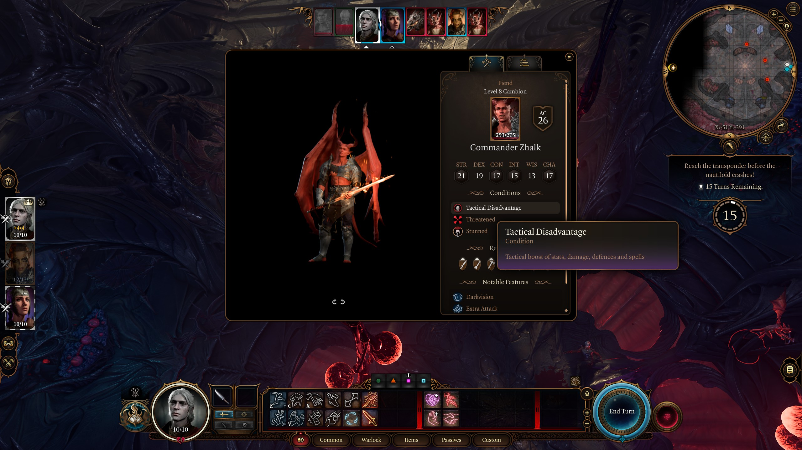
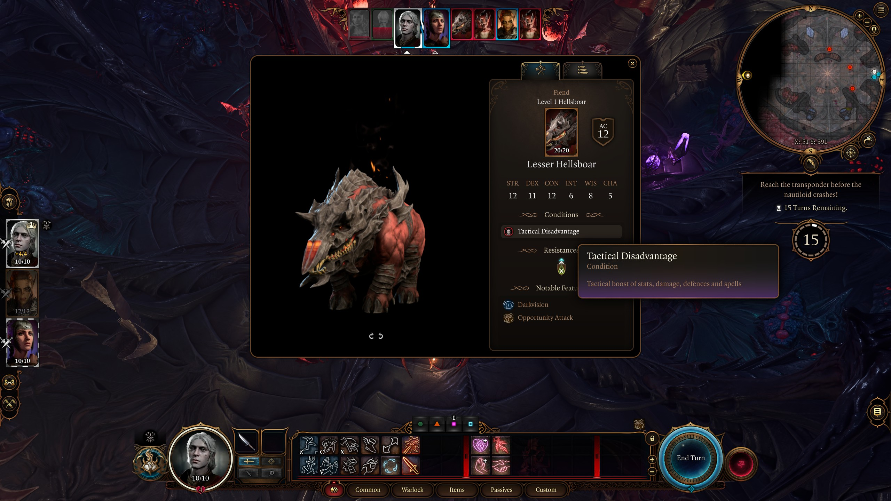

# BG3 Mods

> LICENSE: MIT

## Tactical Disadvantage

Applies a new status to all enemies and, optionally, allies that increases
various stats.

Stat boosts are applied when entering combat, there is no need to restart or
reload a save. JSON Configuration can only be changed when the game is closed.

*Commander Zhalk*, level 8 tutorial Boss



*Lesser Hellboar*, level 1 tutorial minion



### configuration

The mod is configurable using the generated JSON file stored in the [Script Extender][#bg3se] configuration folder:

```
%APPDATA%\..\Local\Larian Studios\Baldur's Gate 3\Script Extender\
```

Sample configuration file:

```json
{
	"allies" :
	{
		"actions" : 0.1,
		"bonus_actions" : 0.3,
		"damage" : 0.2,
		"defense" : 0.2,
		"health" : 5,
		"movement" : 0,
		"resources" : 1,
		"roll_bonus" : 0.2,
		"spell_save_dc" : 0.2,
		"spell_slots" : 2,
		"stat_boost" : 0.2
	},
	"bosses" :
	{
		"actions" : 0.5,
		"bonus_actions" : 2,
		"damage" : 0.7,
		"defense" : 0.8,
		"health" : 12,
		"movement" : 0.5,
		"resources" : 1,
		"roll_bonus" : 0.2,
		"spell_save_dc" : 0.2,
		"spell_slots" : 2,
		"stat_boost" : 0.2
	},
	"enemies" :
	{
		"actions" : 0,
		"bonus_actions" : 0.4,
		"damage" : 1,
		"defense" : 0.5,
		"health" : 2,
		"movement" : 0.2,
		"resources" : 1,
		"roll_bonus" : 0,
		"spell_save_dc" : 0,
		"spell_slots" : 2,
		"stat_boost" : 0.2
	},
	"general" :
	{
		"allies" : false,
		"bosses" : true,
		"enemies" : true
	},
	"info" :
	{
		"actions" : "additional actions",
		"bonus_actions" : "additional bonus actions",
		"damage" : "bonus damage: base + level*config",
		"defense" : "AC: base + level*config",
		"health" : "additional maximum HP: base + level*config",
		"movement" : "additional movement in meters: base + config",
		"resources" : "oath, divinity,rage ...: base + level*config",
		"roll_bonus" : "attack roll bonus: base + level*config",
		"spell_save_dc" : "spell save DC bonus: base + level*config",
		"spell_slots" : "spell slots by level: base + level*config",
		"stat_boost" : "additional stats: base + level*config"
	}
}
```

> Note the generated file might contain _strange_ numbers eg.
> `0.29999999999999999`, this is a rounding during the conversion for floating
> point numbers from lua to JSON.

Boosts are calculated based on the level of the entity and the configured
value. The configuration is split for bosses and simple minion enemies, it will
set different values accordingly.


# Resources

- Norbyte's [Script Extender][bg3se]
- LaughingLeader's [BG3 Modding Tools][bg3moddingtools]
- ShinyHobo's [BG3 Multitool][bg3multitool]

[bg3se]: https://github.com/Norbyte/bg3se
[bg3moddingtools]: https://github.com/LaughingLeader/BG3ModdingTools
[bg3multitool]: https://github.com/ShinyHobo/BG3-Modders-Multitool
